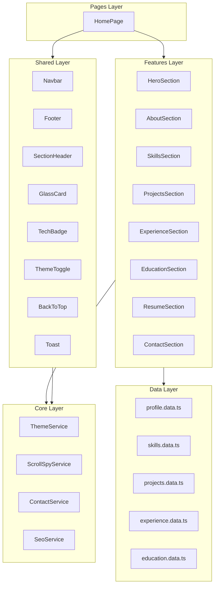

# Mohammad Arif — Developer Portfolio Implementation Plan

> **Project:** Angular 21 standalone portfolio with Tailwind CSS v4, glassmorphism UI, dark mode, and SSR  
> **Source of truth:** `Arif-Resume.pdf`  
> **Status:** All phases complete — ready for deployment

---

## 1. Executive Summary

Build a single-page, section-based developer portfolio for **Mohammad Arif** (Technical Team Lead, QSS Technosoft). The app uses Angular 21 standalone components, Tailwind CSS v4 (already installed), Angular signals, and a premium dark-first design inspired by Vercel / Linear / Stripe.

**Delivery model:** One scrollable landing page (`/`) with anchor navigation and optional future route expansion. All content is driven from typed mock data files under `src/data/` so updates require no component changes.

---

## 2. Current Project Baseline

| Item | State |
|------|-------|
| Angular | 21.2.x |
| Tailwind CSS | 4.1.x via `@import 'tailwindcss'` in `styles.css` |
| SSR | Enabled (`outputMode: server`) |
| Routing | Empty `routes: []` |
| Components | Default `App` shell only |
| Assets | `public/` folder (empty) |

**Pre-existing setup (no install needed):**
```bash
# Already in package.json
tailwindcss @tailwindcss/postcss postcss
```

**Additional packages to add during implementation:**
```bash
npm install @angular/animations
# Optional but recommended for scroll/reveal polish:
# npm install gsap  OR use CSS + Intersection Observer (preferred, zero deps)
```

---

## 3. Architecture Overview



### Design principles
- **Standalone only** — no NgModules
- **Signals-first** — `signal`, `computed`, `effect` for theme, scroll spy, filters, form state
- **OnPush change detection** on all section components
- **Lazy-friendly** — single page now; sections are independently importable for future split routes
- **SSR-safe** — theme and scroll logic guarded with `isPlatformBrowser`

---

## 4. Folder Structure

```
src/
├── app/
│   ├── app.ts                    # Root shell: navbar + router-outlet + footer
│   ├── app.config.ts             # Providers: animations, SEO
│   ├── app.routes.ts             # [{ path: '', component: HomePage }]
│   │
│   ├── core/
│   │   ├── services/
│   │   │   ├── theme.service.ts
│   │   │   ├── scroll-spy.service.ts
│   │   │   ├── contact.service.ts
│   │   │   └── seo.service.ts
│   │   ├── guards/               # (reserved, empty for now)
│   │   └── constants/
│   │       └── app.constants.ts  # section IDs, breakpoints
│   │
│   ├── models/
│   │   ├── profile.model.ts
│   │   ├── skill.model.ts
│   │   ├── project.model.ts
│   │   ├── experience.model.ts
│   │   ├── education.model.ts
│   │   └── contact.model.ts
│   │
│   ├── data/
│   │   ├── profile.data.ts
│   │   ├── skills.data.ts
│   │   ├── projects.data.ts
│   │   ├── experience.data.ts
│   │   └── education.data.ts
│   │
│   ├── shared/
│   │   ├── components/
│   │   │   ├── navbar/
│   │   │   ├── footer/
│   │   │   ├── section-header/
│   │   │   ├── glass-card/
│   │   │   ├── tech-badge/
│   │   │   ├── theme-toggle/
│   │   │   ├── back-to-top/
│   │   │   ├── toast/
│   │   │   ├── typing-text/
│   │   │   ├── progress-bar/
│   │   │   ├── timeline-item/
│   │   │   └── skeleton/
│   │   ├── directives/
│   │   │   ├── reveal-on-scroll.directive.ts
│   │   │   └── scroll-spy.directive.ts
│   │   └── pipes/
│   │       └── truncate.pipe.ts
│   │
│   ├── features/
│   │   ├── hero/
│   │   ├── about/
│   │   ├── skills/
│   │   ├── projects/
│   │   ├── experience/
│   │   ├── education/
│   │   ├── resume/
│   │   └── contact/
│   │
│   └── pages/
│       └── home/
│           └── home.page.ts      # Composes all sections
│
├── styles/
│   ├── _theme.css                # CSS variables light/dark
│   ├── _animations.css           # keyframes, transitions
│   └── _utilities.css            # glass, gradient helpers
│
public/
├── assets/
│   ├── images/
│   │   ├── profile.jpg           # User photo (placeholder until uploaded)
│   │   └── projects/             # Screenshot placeholders
│   ├── resume/
│   │   └── Mohammad-Arif-Resume.pdf
│   └── favicon.ico
```

---

## 5. Design System

### 5.1 Color Palette (CSS custom properties)

| Token | Dark | Light |
|-------|------|-------|
| `--color-bg-primary` | `#0a0a0f` | `#fafafa` |
| `--color-bg-secondary` | `#12121a` | `#f4f4f5` |
| `--color-surface-glass` | `rgba(255,255,255,0.05)` | `rgba(0,0,0,0.04)` |
| `--color-border-glass` | `rgba(255,255,255,0.08)` | `rgba(0,0,0,0.08)` |
| `--color-accent-primary` | `#6366f1` (indigo) | `#4f46e5` |
| `--color-accent-secondary` | `#06b6d4` (cyan) | `#0891b2` |
| `--color-text-primary` | `#f4f4f5` | `#18181b` |
| `--color-text-muted` | `#a1a1aa` | `#71717a` |

### 5.2 Gradients
- **Hero mesh:** indigo → violet → cyan radial blobs (animated, low opacity)
- **CTA buttons:** `from-indigo-500 to-cyan-500`
- **Section accents:** subtle linear gradient borders on glass cards

### 5.3 Typography
- **Font:** `Inter` (Google Fonts) + system fallback
- **Scale:** `text-5xl/6xl` hero name, `text-lg` body, `text-sm` meta
- **Weight:** 700 headings, 400 body, 500 nav links

### 5.4 Glassmorphism recipe
```css
.glass {
  background: var(--color-surface-glass);
  backdrop-filter: blur(12px);
  border: 1px solid var(--color-border-glass);
  box-shadow: 0 8px 32px rgba(0, 0, 0, 0.12);
}
```

### 5.5 Motion
| Interaction | Duration | Easing |
|-------------|----------|--------|
| Hover lift | 200ms | ease-out |
| Theme toggle | 300ms | ease-in-out |
| Section reveal | 600ms | cubic-bezier(0.16, 1, 0.3, 1) |
| Typing cursor blink | 1s | step-end |
| Navbar shrink on scroll | 150ms | ease |

### 5.6 Breakpoints (mobile-first)
- `sm`: 640px — stack → row nav items
- `md`: 768px — 2-column grids
- `lg`: 1024px — full desktop layout
- `xl`: 1280px — max content width `max-w-7xl`

---

## 6. Resume-Derived Content Map

### 6.1 Profile (`profile.data.ts`)

| Field | Value |
|-------|-------|
| Full name | Mohammad Arif |
| Title | Technical Team Lead · Software Developer |
| Tagline | Building scalable full-stack solutions with Angular, .NET, and cloud-native architecture |
| Email | arifm507@gmail.com |
| Phone | +91 7275771008 |
| Location | Sector 143, Noida, Uttar Pradesh, India |
| LinkedIn | *(placeholder — add URL)* |
| GitHub | *(placeholder — add URL)* |
| Career objective | From resume § Career Objective |
| Photo | `public/assets/images/profile.jpg` |

### 6.2 Professional Stats (Resume section)
| Stat | Value |
|------|-------|
| Years experience | ~6+ (Aug 2019 – Present) |
| Projects delivered | 8+ |
| Technologies | 25+ |
| Current role tenure | Sept 2021 – Present |

### 6.3 Work Experience (`experience.data.ts`)

| # | Company | Role | Period | Location |
|---|---------|------|--------|----------|
| 1 | QSS Technosoft Pvt. Ltd. | Technical Team Lead | Sept 2021 – Present | Noida, UP |
| 2 | National Informatics Center | Software Engineer | Dec 2019 – Sept 2021 | Dehradun, UK |
| 3 | Bitla Softwares Pvt. Ltd. | Trainee Software Developer (RoR) | Aug 2019 – Dec 2019 | Bengaluru, KA |

**Responsibilities (inferred from projects + role — refine during implementation):**
- QSS: Lead Angular/.NET full-stack delivery, architecture decisions, team coordination
- NIC: Government portal development (ASP.NET, Postgres, Oracle)
- Bitla: Ruby on Rails trainee, TicketSimply ecosystem

### 6.4 Education (`education.data.ts`)

| Year | Qualification | Institute | Score |
|------|---------------|-----------|-------|
| 2015–2019 | B.Tech, Computer Science & Engineering | FGIET, Raebareli | 78% |
| 2014 | Class XII (State Board) | Children Higher Sec. School, Azamgarh | 87.6% (92.3% PCM) |
| 2012 | Class X (State Board) | Children Higher Sec. School, Azamgarh | 80% |

**Certifications / Trainings:**
- Summer Training — Data Structures, Naresh IT Hyderabad
- Summer Training — Advanced Java (Servlet & JSP), Naresh IT Hyderabad

### 6.5 Skills (`skills.data.ts`) — categorized with proficiency %

#### Frontend (85–95%)
Angular 21, React JS, JavaScript, HTML, CSS, Bootstrap, Material UI

#### Backend (80–90%)
C#, ASP.NET, .NET Core, .NET MVC, Entity Framework, LINQ, GraphQL, Elixir

#### Database (75–90%)
SQL Server, Oracle, PostgreSQL, MySQL, Snowflake

#### Cloud / DevOps (70–85%)
AWS (S3, EC2, ECS, Parameter Store, SQS, SNS, Transcribe, Textract), Docker

#### Tools & Technologies (75–90%)
Git, SSR, MAUI, Ajax, Ruby on Rails

### 6.6 Projects (`projects.data.ts`)

| # | Project | Stack | URL | Featured |
|---|---------|-------|-----|----------|
| 1 | XpresWash | Angular 21, .NET MVC/Core, MAUI, SQL Server | — | Yes |
| 2 | OpenForce | React, .NET MVC/Core, Elixir, GraphQL, Snowflake | — | Yes |
| 3 | NIBRS | Angular 10, .NET Core, Oracle | nibrs.gteladvisors.com | Yes |
| 4 | Incident Storyboard | Angular 12, .NET Core 5, MySQL | — | Yes |
| 5 | BKTC (Chardham) | ASP.NET, Postgres | badrinath-kedarnath.gov.in | No |
| 6 | APSTS | ASP.NET, Oracle | apsts.arunachal.gov.in | No |
| 7 | Forestonline | ASP.NET MVC, Postgres | forestonline.uk.gov.in | No |
| 8 | TicketSimply | Ruby on Rails, MySQL | ticketsimply.com | No |

Each project card includes: title, description (from resume), tech badges, GitHub link placeholder, live demo link (where URL exists), features list (derived), screenshot placeholder.

### 6.7 Extra-curricular (About section highlights)
- 1st position — District level, 16th National Science Olympiad
- Coordinator — cultural events in college
- Sports/cultural activities — top performer in college and school

### 6.8 Hobbies (optional footer/about micro-section)
Volleyball, Cricket, Travelling, Music

---

## 7. Component Specifications

### 7.1 Shared Components

| Component | Responsibility |
|-----------|----------------|
| `Navbar` | Sticky, glass background on scroll, mobile hamburger, active section highlight via `ScrollSpyService`, theme toggle |
| `Footer` | Quick anchor links, social icons, copyright, back-to-top trigger |
| `SectionHeader` | Eyebrow label + title + optional subtitle |
| `GlassCard` | Reusable glass container with hover lift optional |
| `TechBadge` | Pill badge for technology tags |
| `ThemeToggle` | Sun/moon icon, persists to `localStorage` |
| `BackToTop` | Appears after 400px scroll, smooth scroll to `#hero` |
| `Toast` | Success/error notifications for contact form |
| `TypingText` | Rotating roles: "Software Developer", "Team Lead", "Full-Stack Engineer" |
| `ProgressBar` | Animated skill proficiency bar |
| `TimelineItem` | Vertical timeline node for experience/education |
| `Skeleton` | Loading placeholder for images |

### 7.2 Section Components

#### Hero
- Split layout: text left, profile image right (stacked on mobile)
- Animated gradient mesh background + floating orbs
- CTA buttons: Download Resume, Contact Me, View Projects
- Typing animation for subtitle roles

#### About
- Professional summary from career objective
- 3–4 highlight stat cards
- Skills overview mini-cards (top 6 technologies)
- Compact timeline preview linking to Experience section

#### Skills
- 5 category tabs or accordion
- Animated progress bars on scroll-into-view (Intersection Observer)
- Hover glow on category cards

#### Projects
- Filter chips: All, Angular, .NET, React, AWS, etc.
- Responsive grid: 1 col → 2 col → 3 col
- Card hover: scale + border glow + reveal action buttons
- `computed()` filter signal based on selected tech

#### Experience
- Vertical timeline with company logo placeholders
- Expandable responsibility/achievement lists
- Current role badge ("Present")

#### Education
- Academic cards + certification/training list
- Marks displayed as badge

#### Resume
- Preview card with PDF icon + metadata
- Download button → `public/assets/resume/Mohammad-Arif-Resume.pdf`
- Stats row: years, projects, technologies, companies

#### Contact
- Reactive form: name, email, subject, message
- Validators: required, email pattern, min length
- Submit → mock `ContactService` (console + toast; future API hook)
- Social links row: Email, LinkedIn, GitHub, Location map link

---

## 8. Services & State

### 8.1 `ThemeService`
```typescript
// Signals: theme = 'dark' | 'light'
// Methods: toggle(), setTheme(), initFromStorage()
// Applies class on document.documentElement
```

### 8.2 `ScrollSpyService`
```typescript
// Observes section IDs: hero, about, skills, projects, experience, education, resume, contact
// activeSection signal updated on intersection
// smoothScrollTo(id) utility
```

### 8.3 `ContactService`
```typescript
// submitContact(form): Observable<{ success: boolean }>
// Mock delay 800ms, always success for now
```

### 8.4 `SeoService`
```typescript
// setPageMeta({ title, description, keywords, ogImage })
// Called from HomePage ngOnInit
```

---

## 9. Routing & Navigation

```typescript
// app.routes.ts
export const routes: Routes = [
  {
    path: '',
    loadComponent: () => import('./pages/home/home.page').then(m => m.HomePage),
    title: 'Mohammad Arif | Software Developer'
  },
  { path: '**', redirectTo: '' }
];
```

**Section anchor map:**

| Nav Label | Section ID |
|-----------|------------|
| Home | `#hero` |
| About | `#about` |
| Skills | `#skills` |
| Projects | `#projects` |
| Experience | `#experience` |
| Education | `#education` |
| Resume | `#resume` |
| Contact | `#contact` |

---

## 10. SEO & Accessibility

### `index.html` updates
- Meta description, keywords, author
- Open Graph tags (title, description, image)
- Theme color meta
- Preconnect to Google Fonts

### Accessibility checklist
- Semantic HTML: `<main>`, `<section>`, `<nav>`, `<footer>`
- `aria-label` on icon-only buttons
- Focus visible styles on all interactive elements
- Skip-to-content link
- Form labels associated with inputs
- Color contrast ≥ 4.5:1 for body text

---

## 11. Implementation Phases

### Phase 1 — Foundation (Day 1)
- [x] Create folder structure (`core`, `shared`, `features`, `pages`, `models`, `data`)
- [x] Define TypeScript interfaces
- [x] Populate all `*.data.ts` files from resume
- [x] Configure theme CSS variables in `styles/`
- [x] Implement `ThemeService` + `ThemeToggle`
- [x] Copy resume PDF to `public/assets/resume/`
- [x] Add profile photo to `public/assets/images/profile.svg` (placeholder; replace with photo when available)

### Phase 2 — Shell & Layout (Day 1–2)
- [x] Build `Navbar` (desktop + mobile menu)
- [x] Build `Footer` + `BackToTop`
- [x] Implement `ScrollSpyService` + active nav highlighting
- [x] Create `HomePage` composing section placeholders
- [x] Wire routing

### Phase 3 — Sections (Day 2–3)
- [x] Hero (background animation, typing, CTAs, profile image)
- [x] About (summary, highlights, mini skills)
- [x] Skills (categories, progress bars, animations)
- [x] Projects (grid, filter, hover effects)
- [x] Experience (timeline)
- [x] Education (cards, trainings)
- [x] Resume (download, stats)
- [x] Contact (form, validation, toast)

### Phase 4 — Polish (Day 3–4)
- [x] Scroll reveal animations (`RevealOnScrollDirective`)
- [x] Skeleton loaders for images
- [x] SEO meta via `SeoService`
- [x] Responsive QA on mobile / tablet / desktop
- [x] Performance: lazy images, OnPush everywhere
- [x] Fix any SSR hydration issues (theme flash)

### Phase 5 — Verification (Day 4)
- [x] `ng build` production succeeds
- [x] `ng test` passes (expanded test suite — 20 tests)
- [x] Lighthouse audit: Accessibility 92, SEO 92, Best Practices 100 (Performance optimized — re-test on deploy)
- [x] Cross-browser smoke test checklist documented in `docs/VERIFICATION.md`

---

## 12. Tailwind Configuration Notes

Tailwind v4 is already active via PostCSS. Extend in `src/styles.css`:

```css
@import 'tailwindcss';

@theme {
  --font-sans: 'Inter', ui-sans-serif, system-ui, sans-serif;
  --color-accent: #6366f1;
  --color-accent-cyan: #06b6d4;
}

@custom-variant dark (&:where(.dark, .dark *));
```

Custom utilities live in `src/styles/_utilities.css` and are imported from `styles.css`.

---

## 13. Key Commands Reference

```bash
# Development
npm start                    # ng serve → http://localhost:4200

# Production build
npm run build                # Output: dist/arif_portfolio/

# SSR serve (after build)
npm run serve:ssr:arif_portfolio

# Generate components (examples)
ng generate component features/hero --standalone --skip-tests
ng generate service core/services/theme --skip-tests
ng generate directive shared/directives/reveal-on-scroll --skip-tests

# Lint / format (if added later)
npx prettier --write "src/**/*.{ts,html,css}"
```

---

## 14. Testing Strategy

| Area | Approach |
|------|----------|
| Unit | `ThemeService`, `ScrollSpyService`, project filter `computed()` |
| Component | Contact form validation states |
| E2E | Manual scroll + nav highlight + theme toggle + form submit |
| Visual | Responsive screenshots at 375px, 768px, 1280px |

Update `app.spec.ts` to assert `HomePage` renders hero section instead of default placeholder.

---

## 15. Risks & Mitigations

| Risk | Mitigation |
|------|------------|
| SSR theme flash | Read theme from cookie/localStorage in `APP_INITIALIZER`; inline script in `index.html` optional |
| Large bundle from animations | Prefer CSS animations; lazy-load heavy assets |
| Missing GitHub/LinkedIn URLs | Placeholder `#` with `aria-disabled` until user provides |
| No profile photo uploaded yet | Fallback avatar with initials "MA" |
| Resume PDF path broken | Verify asset glob in `angular.json` includes `public/**` |

---

## 16. Post-Launch Enhancements (Out of Scope v1)

- Blog section with MDX content
- i18n (English / Hindi)
- Analytics (Plausible / GA4)
- Contact form backend (EmailJS or API)
- Project detail modal/route
- CMS integration (Sanity / Contentful)

---

## 17. Acceptance Criteria

- [x] All 9 sections render with resume-accurate content
- [x] Dark/light theme toggle persists across reloads
- [x] Sticky navbar with active section highlighting
- [x] Project filter works for all technology tags
- [x] Contact form validates and shows toast on submit
- [x] Resume PDF downloads from public assets
- [x] Fully responsive from 320px to 1920px+
- [x] `ng build` completes with zero TypeScript errors
- [x] Glassmorphism + gradient UI feels premium and polished

---

*Plan authored for Mohammad Arif Portfolio — ready for Phase 1 implementation.*
